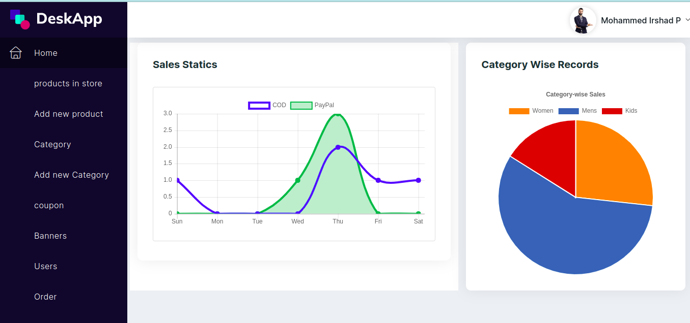

<h1 align="center"> MVC - E-commerce project made with Express and MongoDB</h1>

> Ecommerce made with Node.js - MVC 

<a href="https://ecommerce-4s1j.onrender.com/">Coza store website</a>

## User Interface

## Admin Panel

  The ecommerce project. Built with ❤︎ by
    <a href="https://github.com/Irshadparakkat/Ecommerce/">Mohammed Irshad</a>
  

 

---

# :pushpin: Table of Contents

* [Technologies](#computer-technologies)
* [Features](#rocket-features)

# :computer: Technologies
This project was made using the follow technologies:
<ul>
  <li><a href="https://nodejs.org/en/">Node.js</a></li>
  <li><a href="https://expressjs.com/">Express</a></li>
  <li><a href="https://mongoosejs.com/docs/">Mongoose(MongoDB FrameWork)</a></li>
  <li><a href="https://ejs.co/">EJS</a></li>
  <li><a href="https://getbootstrap.com/docs/4.0/getting-started/introduction/">Bootstrap</a></li>
</ul>   

# :rocket: Features

- User Panel and Admin Panel
- List users and block users
- Category Management(Filter Added)
- Product Management
- Otp login
- Wishlist
- Checkout page
- Track order
- Return order
- User Profile page
- Cart Management
- Address Management
- Banner Management
- 404 page
- Order Management
- Coupon Management
- COD and Payment(Pay Pal)
- Dashboard in admin side
  - Chart Analysis
  - Graph Analysis

Made with love by [Mohammed Irshad](https://github.com/Irshadparakkat) 🚀
